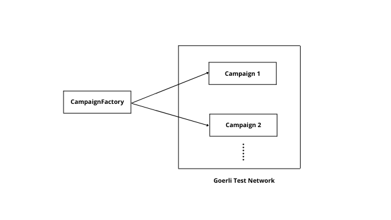
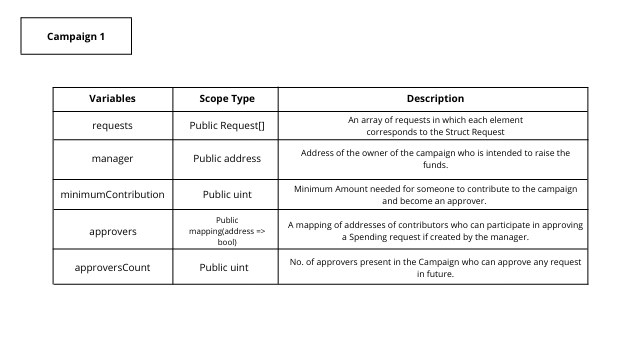
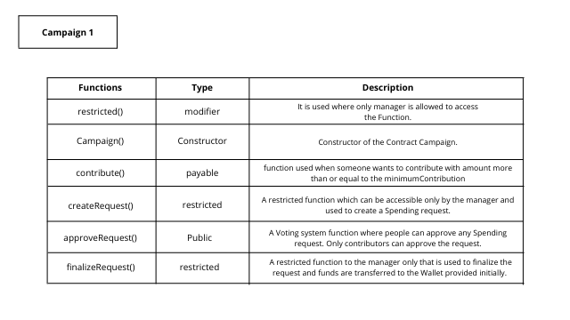

# CrowdFunding

This is a Platform where People can make their Campaign that can be based on anything like Raising money for a Spoon :sweat*smile:
This Platform is inspired from <u><a href = "https://www.kickstarter.com/">Kickstarter</a></u> but a Decentralized and Distributed* version which makes it less prone to any scammer activities.

## Technologies Used


## Follow :blush:

[](https://twitter.com/Lovepre15338771)
[](https://www.instagram.com/alphadecodex)
[](https://www.linkedin.com/in/lovepreet-singh-a18a19191/)

[](https://github.com/AlphaDecodeX/CrowdFunding)

## Table of contents

1. [Usage](#usage)
2. [Directory Structure](#dir)
3. [Why CrowdFunding ?](#why)
4. [Smart Contract Used](#contract)
5. [Future Scope](#future)

### Usage <a name = "usage"></a>

**Note**: _Make sure you have <u><a href = "https://nodejs.org/en/download/">Node.js</a></u> installed._ <br> Run following commands in your terminal.

```bash
git clone https://github.com/AlphaDecodeX/CrowdFunding
cd CrowdFunding
npm install
npm run dev
```

### Directory Structure <a name = "dir"></a>

```
CrowdFunding (Main Project)
│   README.md
│   server.js (Starting point of app)
│   routes.js
│
└───components (React Components)
│   │   ContributeForm.js
│   │   Header.js
│   │   ...
│   │
│   └───ethereum (Contract, Testing and Deployment of Contract)
│       │   compile.js
│       │   deploy.js
│       │   ...
│
└───pages (Routing Pages for Next.Js)
|   │   index.js
|   │   ...
|
└───test (Testing of Contract with Mocha)
    |   Campaign.test.js
```

### Why CrowdFunding ?<a name = "why"></a> :smiley:

At the <u><a href = "https://www.kickstarter.com/">Kickstarter</a></u> You can raise funds for your Project (Can create a campaign). People do create campaigns and gets funds by a no. of contributers. The main Problem with this Platform is One can scam others by creating a visual appealing campaign, and can run away with the money raised. <br><br>
To overcome this Problem, _Crowdfunding_ is a Platform which is distributed and decentralized with a Proper voting system. The Process of raising funding through Crowdfunding is as follows :wink:

- Campaign is created _(Manager - The one who creates the campaign)_ with some minimum contribution set limit.
- If manager needs funds then H/She have to create a Spending request with address of wallet provided(The address to whom the money of contributers will be sent).
- Now, Approvers can approve the spending request by voting (Approvers are those who contributed into the campaign with atleast minimum amount)
- After getting enough approvals (Approvals > TotalApprovals/2) then the money contributed by the contributers till now will get transferred to the provided wallet.

### Smart Contract Used <a name = "contract"></a>

<br>





### Future Scope <a name = "future"></a> :blush: :blush:

- :rocket: Feel free to make this System more robust and You can contact me over my social handles provided above at the top.
- :airplane: Don't forget to Follow and Give a Star. Peace :v:
